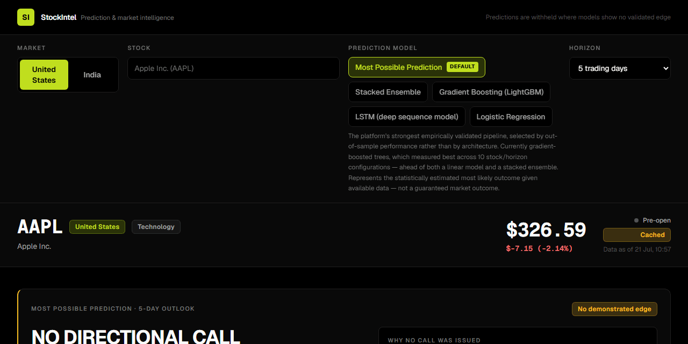
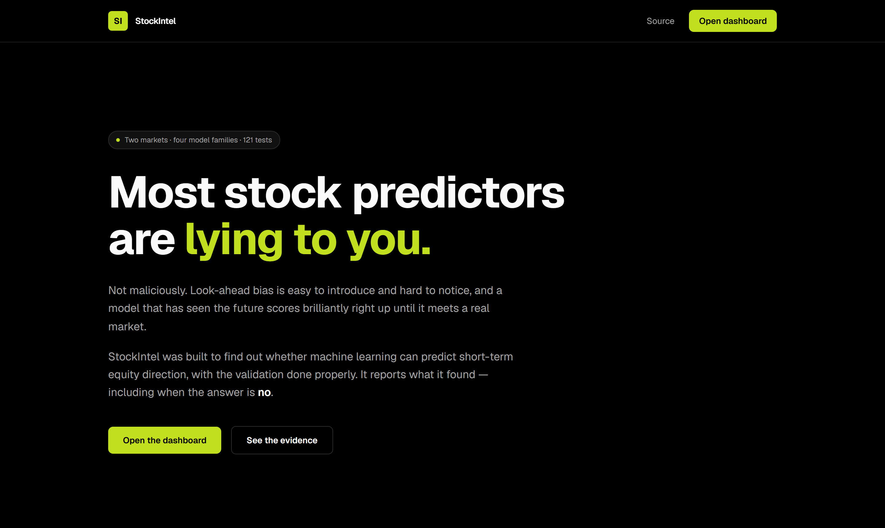
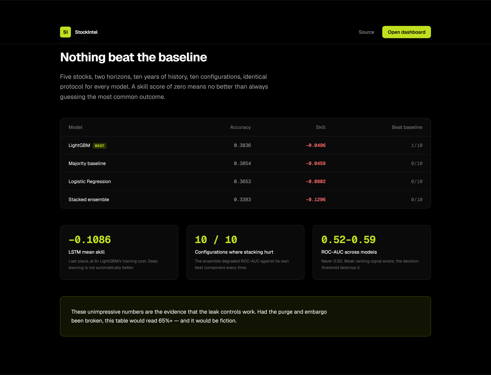
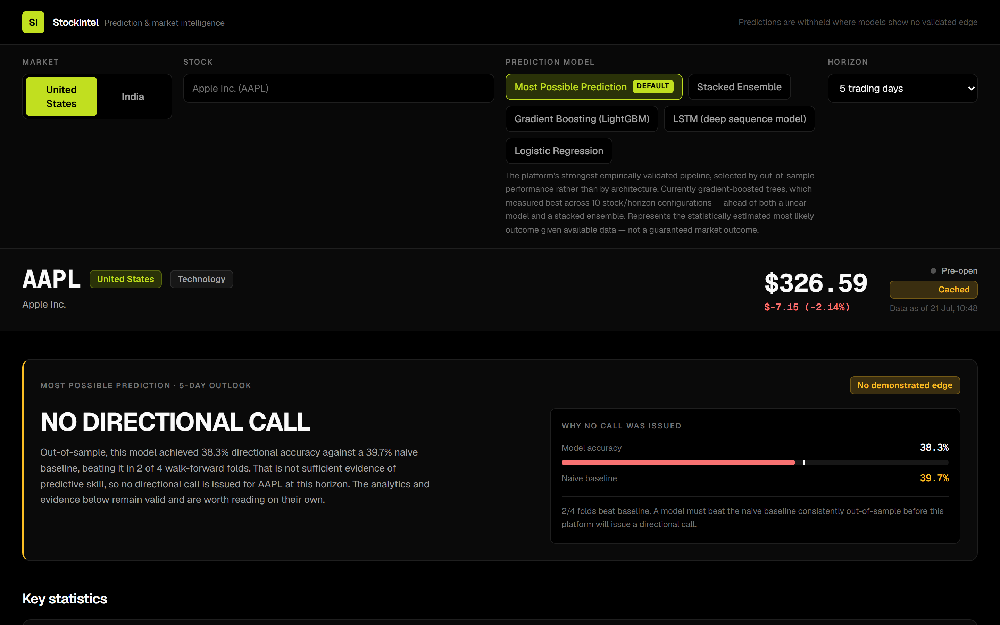
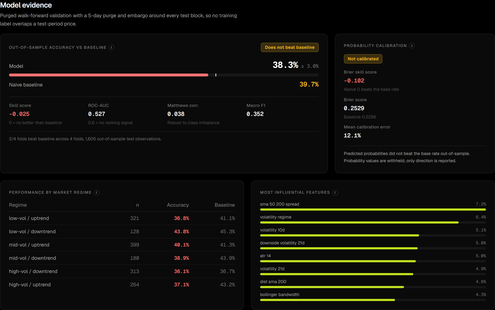
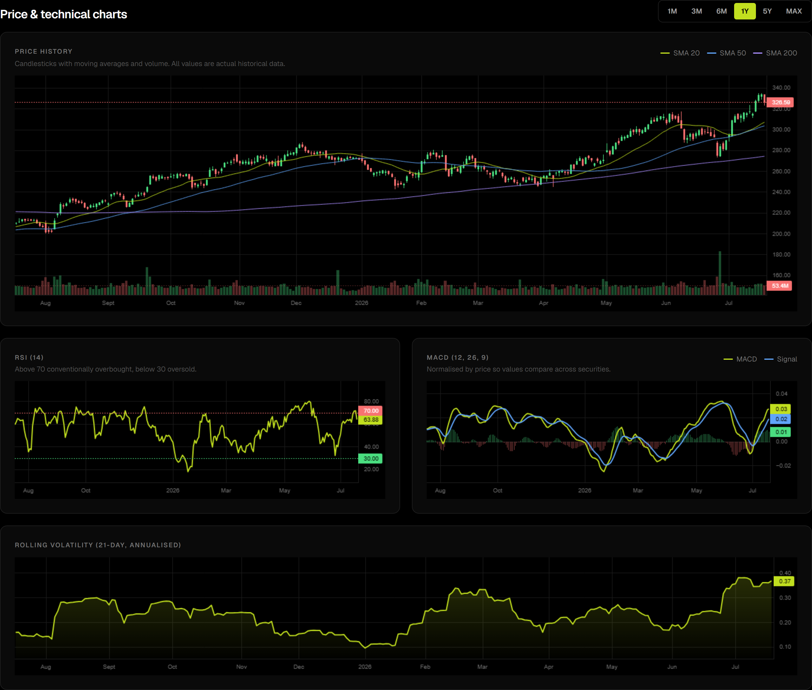
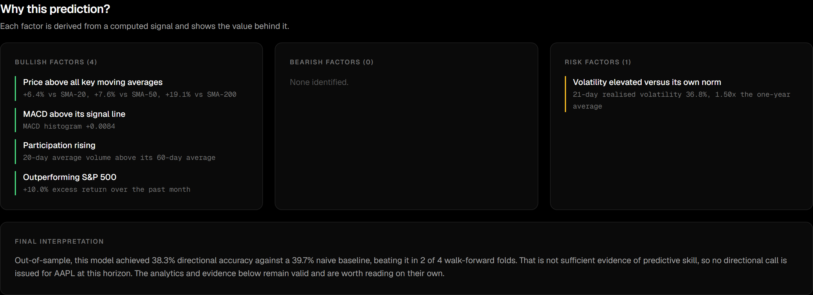
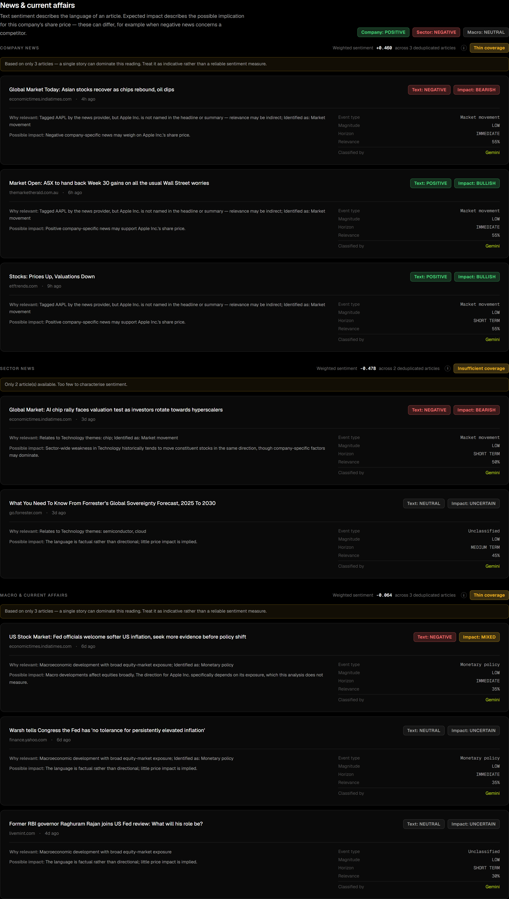

# StockIntel



*Switching markets: `$326.59` against the S&P 500 becomes `₹1,315.90` against the
NIFTY 50. Currency, benchmark, exchange timezone and the searchable stock
universe change together — market status reads "Pre-open" in New York but
"Market open" in Mumbai. The pause is real: the model re-validates on the new
series rather than reusing anything from the previous one.*

An AI stock-market prediction and intelligence platform for US and Indian
equities, built to answer a question honestly rather than to look confident:

> **Can machine learning predict short-term equity direction from price data?**

On this data, with leakage properly controlled: **no.** Four model families
across two markets, four horizons and ~10 years of history fail to beat a naive
baseline out of sample. The platform reports that in the UI instead of hiding
it, and the interesting engineering is in *how it establishes* that finding —
purged walk-forward validation, a calibration gate, an abstention mechanism, and
a news pipeline that keeps text sentiment separate from expected price impact.

> **Not financial advice.** Predictions are statistical estimates from
> historical data. They are not guarantees and must never be the sole basis for
> an investment decision.

> **This repository holds two independent projects.** StockIntel lives in
> `stockintel/` and is documented here. An earlier Streamlit + TensorFlow
> price-forecasting system lives at `app.py` / `src/`, still runs, and is
> documented in
> [docs/legacy-streamlit-project.md](docs/legacy-streamlit-project.md).
> See [The other project in this repository](#the-other-project-in-this-repository).

---

## Contents

- [The headline result](#the-headline-result)
- [Quick start](#quick-start)
- [What it does](#what-it-does)
- [Screenshots](#screenshots)
- [Architecture](#architecture)
- [Measured results](#measured-results)
- [Sentiment pipeline](#sentiment-pipeline)
- [How honesty is enforced](#how-honesty-is-enforced)
- [Design decisions](#design-decisions)
- [Known limitations](#known-limitations)
- [Project layout](#project-layout)
- [Testing](#testing)
- [The other project in this repository](#the-other-project-in-this-repository)
- [License](#license)

---

## The headline result

Every model was evaluated under an identical purged walk-forward protocol.
`skill` is `(accuracy − baseline) / (1 − baseline)`: zero means no better than
always guessing the majority class, negative means worse.

**Five stocks × two horizons (10 configurations):**

| Model | Mean accuracy | Mean skill | Beat baseline |
|---|---|---|---|
| **LightGBM** | 0.3836 | **−0.0496** | **1/10** |
| Majority baseline | 0.3854 | −0.0459 | 0/10 |
| Logistic Regression | 0.3653 | −0.0802 | 0/10 |
| Stacked ensemble | 0.3383 | −0.1296 | 0/10 |

**Four stocks × two horizons, including the LSTM (8 configurations):**

| Model | Mean skill | Beat baseline | Mean fit time |
|---|---|---|---|
| Majority baseline | −0.0381 | 0/8 | 0.1s |
| LightGBM | −0.0598 | 0/8 | 5.3s |
| Logistic Regression | −0.0830 | 0/8 | 0.4s |
| LSTM | −0.1086 | 0/8 | 32.1s |

Across 40 model-runs the single positive result is MSFT 5-day LightGBM at
**+0.0024** skill — 0.2 percentage points, indistinguishable from noise.

**These unimpressive numbers are the evidence that the leakage controls work.**
Published daily-direction accuracies of 70–90% are almost always look-ahead
bias. If the purge/embargo here were broken, this table would show 65%+ and it
would be fiction.

Raw reports are in `backend/.artifacts/*.json`.

---

## Quick start

**Requirements:** Python 3.13, Node 20.9+.

### Backend

```bash
cd stockintel/backend
python -m venv .venv
.venv/Scripts/pip install -r requirements.txt      # macOS/Linux: .venv/bin/pip

cp .env.example .env                               # then add your keys
.venv/Scripts/python -m uvicorn app.main:app --port 8000
```

API docs at http://localhost:8000/docs

### Frontend

```bash
cd stockintel/frontend
npm install
npm run dev
```

Landing page at http://localhost:3000, dashboard at
http://localhost:3000/dashboard

### API keys

The application **runs fully without any keys.** Market data and sentiment need
none. Anything unconfigured renders an explicit `NOT CONFIGURED` state with
setup instructions — never fabricated data.

| Service | Env var | Needed for | Free tier | Obtain |
|---|---|---|---|---|
| Marketaux | `MARKETAUX_API_KEY` | News, sentiment, event impact | 100 req/day | [marketaux.com](https://www.marketaux.com/) |
| FRED | `FRED_API_KEY` | Macro series | Free | [fred.stlouisfed.org](https://fred.stlouisfed.org/docs/api/api_key.html) |
| Gemini | `GEMINI_API_KEY` | Event classification (optional) | Yes | [aistudio.google.com](https://aistudio.google.com/apikey) |

Secrets belong in `.env`, which is gitignored. `.env.example` is committed and
must only ever hold empty placeholders.

`GEMINI_MODEL` optionally pins a model — Google retires models for new projects
without notice (`gemini-2.5-flash` returned HTTP 404 *"no longer available to
new users"* during development).

---

## What it does

Select a market → search a stock → pick a model and horizon → get a prediction
with the evidence behind it.

- **Two markets** with fully separated conventions: currency, benchmark
  (S&P 500 / NIFTY 50), exchange timezone and trading-day count for
  annualisation. Currencies never mix.
- **Four prediction horizons** — 1 day (binary), and 5/10/20-day three-class
  outlooks.
- **Four model modes** — Most Possible Prediction (the best measured pipeline),
  Stacked Ensemble, LightGBM, LSTM, Logistic Regression.
- **34 technical features** across five groups, all scale-free and stationary.
- **Full analytics** — returns, volatility regime, momentum, volume, drawdown,
  beta, benchmark comparison, fundamentals.
- **Interactive charts** — candlesticks with moving averages and volume, RSI,
  MACD, rolling volatility.
- **Model evidence** — walk-forward accuracy against baseline, calibration,
  per-regime breakdown, feature importance.
- **News & current affairs** — company, sector and macro news with FinBERT
  sentiment, LLM event classification and per-article impact analysis.

---

## Screenshots

**The landing page** (`/`) — leads with the finding rather than around it.
Every figure on it is a real measured result, which felt like the minimum bar
for a page whose argument is that most stock predictors report numbers they
cannot support.





**The prediction verdict** (`/dashboard`) — the default state for most stocks. The model did
not beat its baseline, so no directional call is issued, and the panel shows the
comparison that produced that verdict rather than asking you to take it on trust.



**Model evidence** — accuracy is never shown without the baseline beside it, the
calibration gate withholds probabilities that fail it, and performance is broken
down per market regime because a model that only works in calm markets is
dangerous precisely when a prediction matters.



**Charts** — candlesticks with SMA 20/50/200 and volume, RSI with its
conventional bands, MACD normalised by price, and rolling annualised volatility.



**Why this prediction** — factors derived from computed signals, each citing the
value behind it. Nothing appears here that isn't in the data.



**News & current affairs** — per-article text sentiment and expected company
impact shown as separate fields, with relevance, magnitude, horizon, coverage
caveats and which classifier produced the event type.



The full dashboard in one image:
[docs/screenshots/dashboard-full.png](docs/screenshots/dashboard-full.png).

Captured against a live instance by
[`screenshot.mjs`](stockintel/frontend/scripts/screenshot.mjs) and
[`demo-gif.mjs`](stockintel/frontend/scripts/demo-gif.mjs) — run either with
both dev servers up to regenerate. The GIF is encoded in pure JavaScript
(`pngjs` → `gifenc`), so no ffmpeg install is required.

---

## Architecture

```
Frontend  Next.js 16 · React 19 · Tailwind 4 · lightweight-charts 5
              │  REST
Backend   FastAPI · Python 3.13
              ├── data/      market (yfinance), news (Marketaux), fundamentals
              ├── features/  technical indicators, targets, leakage probe
              ├── models/    baselines, tabular, LSTM, ensemble, selective
              ├── backtesting/  purged walk-forward, metrics, calibration
              └── services/  analytics, prediction, sentiment, event relevance, LLM
Storage   SQLite (JSON cache) + Parquet (OHLCV frames)
ML        scikit-learn · LightGBM · PyTorch
NLP       FinBERT (local) · Gemini (event classification)
```

**PyTorch, not TensorFlow** — FinBERT runs on torch, so one framework serves
both the LSTM and the NLP model instead of a ~5 GB dual install.

**SQLite + Parquet, not Postgres/Redis** — no infrastructure that isn't earned.
Different data ages differently, so TTLs differ: quotes 60s, bars 1h, news
15min, fundamentals 1 day, sentiment 7 days keyed by content hash.

---

## Measured results

### Prediction targets

A next-day price regressor trained on a near-random-walk series learns to echo
today's close, scores a flattering R², and predicts nothing. So targets are
directional:

- **1-day** — binary up/down.
- **5/10/20-day** — three-class, with the neutral band scaled by realised
  volatility: `BULLISH` if `r > +0.5σ_h`, `BEARISH` if `r < −0.5σ_h`.

The σ-scaling is what makes `NEUTRAL` learnable. Measured class balance:

| Stock | BEARISH | NEUTRAL | BULLISH |
|---|---|---|---|
| AAPL | 0.275 | 0.363 | 0.362 |
| RELIANCE.NS | 0.294 | 0.393 | 0.313 |
| TCS.NS | 0.307 | 0.396 | 0.297 |

A fixed ±2% band would have produced a degenerate class on one market or the
other.

### There is signal — it just doesn't survive a decision threshold

ROC-AUC lands at **0.52–0.59** in essentially every ML configuration, never
0.50, and MCC is positive in most. That combination means real *ranking* signal
destroyed by the argmax threshold on a ~53/47 class split.

Two attempts to exploit it, both failing honestly:

1. **Longer horizons** improved AUC (up to 0.588 at 20 days) but not accuracy.
2. **Selective prediction** (abstention) — risk-coverage curves slope downward
   in **25/36** configurations (mean slope −0.055), confirming confidence is
   informative. But the threshold does not transfer out of sample.

The reason abstention fails is worth stating, because it is the difference
between an honest platform and a flattering one. Abstaining preferentially
answers where one class already dominates, which **raises the bar** it must
clear:

```
overall baseline          0.4122
answered-subset baseline  0.4293    (higher in 25/36 configs, +0.017 mean)
```

Scored against the *full-period* baseline the model appears to win 17/36. Scored
against the *answered-subset* baseline — the correct comparison — it wins 11/36.
`SelectiveReport.baseline_accuracy` always uses the subset, and a test pins it.

### Deep learning did not help

The LSTM finished **last** — behind gradient boosting, a linear model, and the
naive baseline — at 6× LightGBM's training cost. Its AUC is competitive
(0.481–0.593, including the highest single AUC in the run) but its decisions are
worse.

A control test confirms this is absence of signal rather than a broken pipeline:
on synthetic data where the label genuinely *is* the previous row's feature sign,
the same model reaches **>75%**.

### Stacking made things worse

The ensemble lost to its own best component in every configuration and degraded
ROC-AUC in **10 of 10**:

```
AAPL 5d      0.528 → 0.500      MSFT 5d       0.568 → 0.553
AAPL 20d     0.531 → 0.508      MSFT 20d      0.567 → 0.562
NVDA 5d      0.528 → 0.509      RELIANCE 5d   0.532 → 0.509
NVDA 20d     0.490 → 0.467      RELIANCE 20d  0.568 → 0.560
TCS 5d       0.526 → 0.515      TCS 20d       0.574 → 0.524
```

Weak base models produce noisy out-of-fold predictions; the meta-learner fits
that noise. The stack is not broken — its learned weights are genuine and vary
per configuration (0.75/0.25 to 0.39/0.61) — the method is simply wrong for this
data.

**"Most Possible Prediction" therefore resolves to LightGBM, not the ensemble.**
Defaulting to the stack because ensembles are conventionally stronger would hand
every user the worst performer under the most confident-sounding label.

---

## Sentiment pipeline

Price-derived features are exhausted. News sentiment is the only input class
that has never been tested, so the machinery to test it exists and is
tier-agnostic — identical code on the free tier (3 articles/request) and a paid
one (100), differing only in how much quota a day of history costs.

```
Marketaux ──> archive (SQLite) ──> FinBERT ──> point-in-time features ──> model
              persistent            cached      aligned to session closes
```

| Stage | Module | Notes |
|---|---|---|
| Backfill | `data/news/backfill.py` | Day-at-a-time, resumable, quota-bounded |
| Archive | `data/news/archive.py` | Persistent store for articles and their scores |
| Scoring | `services/sentiment.py` | FinBERT, cached by content hash |
| Features | `features/sentiment_features.py` | Point-in-time aggregation |

```bash
python -m scripts.backfill_news AAPL --days 60 --max-requests 80
python -m scripts.backfill_news --status
```

### The timing rule

> The feature vector for session **D** may use **only** articles published at or
> before **D**'s close.

Easy to state, easy to violate, and violating it silently inflates every
downstream metric. Two failure modes, both pinned by tests:

- **Naive date joins.** Grouping by calendar date puts an 18:00 article in the
  same bucket as a 16:00 close — a two-hour peek at the outcome, which on a
  1-day horizon is a large fraction of the thing being predicted.
- **Timezone drift.** Article timestamps are UTC; a 16:00 ET close is 20:00
  *or* 21:00 UTC depending on daylight saving, and 15:30 IST is 10:00 UTC.

So articles are assigned by comparing tz-aware instants derived from each
market's own conventions. `test_sentiment_features.py` asserts that an article
one minute after the close lands on the *next* session, and that the same UTC
instant assigns to different sessions in New York and Mumbai.

Sessions with no news carry a neutral 0.0 score **plus** `has_news_coverage = 0`,
so a model can distinguish "no news" from "neutral news" rather than conflating
them.

### Three bugs this found

Worth recording, because all three were invisible to reasoning and only
appeared when the pipeline ran against the live API:

1. **The API key leaked into logs.** `requests`' `HTTPError` message embeds the
   full request URL, which carries `api_token=<secret>`. Log files get shared.
   A test now asserts the key appears in neither the exception nor the progress
   report.
2. **Marketaux signals quota exhaustion with HTTP 402, not 429.** The live news
   endpoint was returning `502 Bad Gateway` to users who had merely used up
   their daily allowance.
3. **A 1000× unit mismatch silently dropped every article.** pandas 3 stores
   these as `datetime64[us]`, so `astype("int64")` yields microseconds while
   `Timestamp.value` returns nanoseconds. Every article sorted past every
   session close and vanished — no crash, just an empty feature.

---

## How honesty is enforced

Not by convention — by tests that fail if a guarantee breaks.

| Guarantee | Mechanism | Test |
|---|---|---|
| No look-ahead in features | Truncate the series, recompute, assert values at `t` are unchanged | `test_features_have_no_lookahead` |
| No label overlap across splits | Purge + embargo sized to the horizon | `test_train_never_overlaps_test_label_window` |
| Accuracy never shown without its baseline | `skill_score` computed everywhere | `test_skill_score_is_zero_for_majority_guessing` |
| Probabilities only if calibrated | Brier-skill gate; withheld otherwise | `test_uncalibrated_probabilities_are_rejected` |
| Abstention scored against the right bar | Subset baseline, not full-period | `test_baseline_is_computed_on_the_answered_subset_not_the_full_period` |
| Stacking trained on out-of-fold data | Nested purged inner walk-forward | `test_meta_learner_trains_on_out_of_fold_predictions_only` |
| LSTM windows are causal | Assert `window.max() <= i` | `test_window_contains_only_past_and_present` |
| Scalers fitted on training rows only | Assert fitted mean ≠ full-series mean | `test_scaler_is_fitted_on_training_rows_only` |
| Negative competitor news reads bullish | Relationship-based sign inversion | `test_negative_competitor_news_is_bullish_not_bearish` |
| Impact language stays probabilistic | Assert hedges present, "guaranteed" absent | `test_impact_language_is_probabilistic` |
| Prompt injection can't flip impact | Hostile headline, assert impact unchanged | `test_hostile_article_text_cannot_flip_the_impact` |
| News can't be read before publication | Article 1 min after close lands on the *next* session | `test_article_just_after_close_lands_on_the_next_session` |
| Sentiment features stay causal | Truncate future sessions, assert earlier values unchanged | `test_features_are_causal_under_truncation` |
| API keys never reach logs | Force a provider error, assert the key is absent | `test_http_error_message_never_contains_the_api_key` |
| Missing data renders as missing | `null` → em dash, never `0` | Enforced by the `Stat` component |

**The prediction is gated on demonstrated skill.** If a model fails to beat its
baseline consistently, the API returns `NO_EDGE` and the dashboard shows the
accuracy-vs-baseline comparison that produced the verdict — not a directional
call. Given the results above, this is the *common* case, so it is designed as a
first-class state rather than an error.

---

## Design decisions

**Volatility-scaled neutral band.** A fixed threshold means different things for
a utility and a small-cap, and across calm and panicked regimes. Scaling by the
stock's own realised volatility makes `NEUTRAL` mean "moved less than this stock
normally moves".

**Scale-free features.** Indicators are emitted as normalised derivatives —
distance-from-MA rather than the MA level, %B rather than raw bands. A raw
SMA-200 of 1800 tells a model about Reliance's price scale, not its trend.

**Effective sample size.** Daily-sampled 20-day forward returns overlap by 19 of
20 days, so 2,124 rows is really ~106 independent windows. Reported alongside
every long-horizon metric.

**Market status inferred from data.** No hardcoded holiday table — those are
correct when written and quietly wrong a year later. Weekends and hours are
rule-based; exchange holidays are detected as "the exchange published no bar
today".

**Nulls dropped, never forward-filled.** Forward-filling a close manufactures a
zero-return day the model learns as a real low-volatility observation.

**FinBERT labels read from model config.** `id2label` is
`{0: positive, 1: negative, 2: neutral}` — *not* the conventional order.
Hardcoding indices yields perfectly inverted sentiment: plausible, stable in
aggregate, and completely wrong.

**Text sentiment ≠ company impact.** Separate fields. "Competitor's factory
burns down" is negative text and potentially bullish impact. Macro events
resolve to `MIXED` because the platform does not measure a company's specific
rate exposure and won't pretend to.

**The LLM classifies events; it does not decide direction.** Impact direction
stays in the rule engine — it's the correctness guarantee, it's tested, and it
must behave identically with or without an API key.

**Gemini model chosen by measurement.** Same headline, identical output:
`gemini-3.5-flash` 9.75s vs `gemini-3.1-flash-lite` **1.11s**. At ~10s a call, a
20s timeout was failing half of all requests. Classification against a fixed
enum gains nothing from a reasoning budget.

**Semantic colours over brand purity.** Lime `#C1DF1F` on black `#000000` is the
identity, but bullish/bearish use green/red. Encoding "up" as lime puts two
similar-luminance yellows and reds adjacent in charts and destroys readability.

---

## Known limitations

**Sentiment is collected and displayed, but not yet validated as a predictive
feature.** The one genuinely untested hypothesis in the project.

The full pipeline exists — archive, backfill, point-in-time features, coverage
reporting (see [Sentiment pipeline](#sentiment-pipeline)). What is missing is
data volume. Marketaux's free tier caps every response at 3 articles:

```
found: 99124    returned: 3    limit: 3
```

Historical backfill *does* work: an explicit `published_before` window returns
real articles from arbitrary past dates. The constraint is throughput, not
availability. At 3 articles per request and 100 requests/day the ceiling is
~300 articles/day, where a defensible experiment needs dense coverage across
~2,000 sessions for several stocks.

A live run against AAPL fetched, archived and scored 71 articles before the
daily allowance ran out:

```
AAPL   5/28 sessions (17.9%), 71 articles, 14.2/session, usable=False
```

`usable=False` is the coverage guard: below 30% of sessions carrying news, a
sentiment feature is mostly its own missing-data indicator — the model learns
"was there news today", not "what did the news say".

**No sentiment backtest is reported**, because a number produced from 71
articles would be fabricated evidence. A paid tier (100 articles/request) runs
the same code unchanged and collects a year of history in roughly an hour.

**Aggregate sentiment is thin.** With 3 articles per section, a single story can
dominate. Aggregates are labelled `ADEQUATE` / `THIN` / `INSUFFICIENT` and the
UI shows a warning band.

**FinBERT misses hedged comparatives.** Measured: "fell less than feared as the
company narrowed its quarterly loss" reads NEGATIVE (0.97). It is solid on
earnings, losses, AGM notices and appointments.

**Market data is delayed.** yfinance is an unofficial, delayed feed. The UI
never claims `REAL_TIME`; it reports `DELAYED`, `END_OF_DAY` or `CACHED`.

**No transaction costs or slippage.** Metrics are classification metrics, not
trading returns. A directional edge of this size would not survive costs anyway.

**Fundamentals coverage is uneven**, especially for Indian listings. Missing
fields render as `DATA UNAVAILABLE`, never as zero.

---

## Project layout

```
.
├── README.md                    this file
├── docs/
│   └── legacy-streamlit-project.md    the earlier project's documentation
│
├── app.py, src/, theme.py       earlier Streamlit + TensorFlow project
│
└── stockintel/                  this project
    ├── backend/
    │   ├── app/
    │   │   ├── api/routes/      markets, analysis, news, meta
    │   │   ├── backtesting/     splits (purge/embargo), metrics, harness
    │   │   ├── core/            config, errors, logging
    │   │   ├── data/
    │   │   │   ├── cache/       SQLite + Parquet TTL store
    │   │   │   ├── market/      providers, prices, calendar
    │   │   │   ├── news/        Marketaux, dedupe, archive, backfill
    │   │   │   └── fundamentals/  company profiles
    │   │   ├── features/        technical, sentiment, targets, leakage probe
    │   │   ├── models/          baselines, tabular, lstm, ensemble, selective
    │   │   └── services/        analytics, prediction, sentiment,
    │   │                        event relevance, llm
    │   ├── scripts/             model comparison experiments
    │   └── tests/
    └── frontend/
        └── src/
            ├── app/            landing page, dashboard, design system
            ├── components/     controls, prediction, charts, analytics,
            │                   evidence, news
            └── lib/            API client, types, formatting
```

40 backend modules (~6,900 lines), 14 frontend files (~3,000 lines).

---

## Testing

```bash
cd stockintel/backend
.venv/Scripts/python -m pytest                        # 121 tests
.venv/Scripts/python -m pytest --ignore=tests/test_lstm.py    # skip the slow ones

RUN_LIVE_LLM_TESTS=1 .venv/Scripts/python -m pytest tests/test_llm_classification.py
```

Integration tests run against live market data and skip cleanly when the network
is unavailable. The failure modes that matter here — a provider changing its
response shape, a pandas upgrade altering rolling semantics, an indicator
quietly reading the future — are invisible to tests run against fixtures.

Reproduce the experiments:

```bash
.venv/Scripts/python -m scripts.compare_models     # baselines vs tabular
.venv/Scripts/python -m scripts.test_horizons      # horizons + abstention
.venv/Scripts/python -m scripts.compare_lstm       # LSTM head-to-head
.venv/Scripts/python -m scripts.compare_final      # ensemble head-to-head
```

Collect news for the sentiment experiment (requires `MARKETAUX_API_KEY`):

```bash
.venv/Scripts/python -m scripts.backfill_news AAPL --days 60 --max-requests 80
.venv/Scripts/python -m scripts.backfill_news --status
```

Frontend:

```bash
cd stockintel/frontend
npx tsc --noEmit && npm run lint
```

---

## The other project in this repository

This repository also contains an earlier, independent **Streamlit + TensorFlow
LSTM price-forecasting system**, which remains fully functional and untouched:

```bash
.venv/Scripts/streamlit run app.py
```

Its code lives at `app.py` and `src/`, and its documentation — architecture,
the mathematics of LSTM cells, indicator formulas, evaluation metrics — is
preserved at **[docs/legacy-streamlit-project.md](docs/legacy-streamlit-project.md)**.

The two are deliberately separate. That project forecasts *price levels* with
deep learning; StockIntel forecasts *direction* and is built around validating
whether such forecasts hold up out of sample. They use different virtual
environments and share no runtime code.

StockIntel's market-provider abstraction **is** adapted from that project's
`src/markets` package, including its verified finding that NSE's own site blocks
automated requests (HTTP 403 on the homepage, 503 on the equity-list CSV, behind
a WAF) — which is why Indian listings here are sourced through Yahoo Finance's
search API rather than NSE directly.

---

## License

[MIT](LICENSE) — use, modify and redistribute freely, including commercially,
provided the copyright notice is retained.

The license disclaims warranty and liability in the usual way, but to state it
plainly rather than only in legal boilerplate: **this software makes no
guarantees about market outcomes.** Its own headline finding is that the models
here do not beat a naive baseline out of sample. Treat it as an analytics and
research tool, not as a basis for investment decisions.

Third-party components carry their own licenses — notably FinBERT
(`ProsusAI/finbert`), and the market and news data providers, whose terms of use
govern how their data may be used and redistributed.
